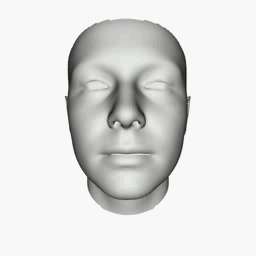
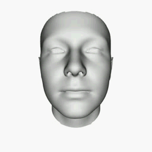

# Write-a-Speaker
Mocap Dataset of “Write-a-speaker: Text-based Emotional and Rhythmic Talking-head Generation”
[paper](https://arxiv.org/pdf/2104.07995.pdf)    [demo video](https://www.youtube.com/watch?v=weHA6LHv-Ew)  [dataset](https://drive.google.com/drive/folders/1sIWJHJtshoeXaKQc6yuTm2WSuoyYAHsv?usp=sharing)

### Emotional Mocap Dataset
#### Introduction
Some facial expression blendshapes are illustrated as blow. The full 51 facial expression blendshapes can be observed in **./images**.

  

  

#### Downloading
The dataset is released in [Google Drive](https://drive.google.com/file/d/1eMcZyPjV5uWzI1raGC5GXCvYwREqX-9E/view?usp=sharing). Please download and read the LICENSE AGREEMENT carefully, and send the signed license agreement to dingyu01@corp.netease.com via email. We will add your email to the shared list. **Note: the permission for application is only open to researchers or faculty of universities or research institutes. It is prohibited for students to apply.**
